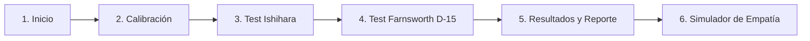

# Documento de Producto (PRD) — *Chromatix*

> **Estado:** Aprobado y definido  
> **Versión:** 1.0  
> **Tecnologías:** HTML5, Vanilla CSS, JavaScript ES6+, Vite  
> **Arquitectura:** Single Page Application (SPA) con flujo lineal interactivo  

---

## 1. Visión y Propósito del Producto

**Chromatix** es una aplicación web interactiva, moderna y accesible diseñada para evaluar de manera orientativa la percepción visual del color y concientizar sobre el daltonismo.

La plataforma guía al usuario a través de un recorrido estructurado de **6 pantallas interactivas**, combinando dos de las metodologías oftalmológicas más reconocidas (el test de placas pseudoisocromáticas de Ishihara y el test de ordenación de tonos de Farnsworth D-15), culminando en un reporte descargable y una herramienta interactiva de simulación.

---

## 2. Objetivos del Sistema

1. **Detección preliminar no invasiva:** Evaluar deficiencias en conos L (Protanopia), M (Deuteranopia) y S (Tritanopia), así como monocromacia/acromatopsia.
2. **Generación procedural en Canvas/SVG:** Evitar imágenes estáticas pesadas utilizando gráficos vectoriales y Canvas dinámicos con matrices de color calibradas en las líneas de confusión de daltonismo.
3. **Experiencia de usuario fluida (SPA):** Transición suave entre pantallas sin recargas de página, con estados en memoria y animaciones sutiles.
4. **Generación de Reporte Descargable:** Permitir al usuario descargar un certificado visual de su perfil cromático en formato imagen (PNG) o documento (PDF).
5. **Simulador de empatía:** Proporcionar un comparador interactivo para que usuarios con visión estándar experimenten la percepción con cada tipo de daltonismo.

---

## 3. Tipos de Daltonismo Evaluados

| Tipo | Cono Afectado | Espectro | Prevalencia estimada |
| :--- | :--- | :--- | :--- |
| **Protanopia / Protanomalía** | Cono L (Rojo) | Deficiencia rojo-verde | ~1-2% en hombres |
| **Deuteranopia / Deuteranomalía** | Cono M (Verde) | Deficiencia rojo-verde (más común) | ~5-6% en hombres |
| **Tritanopia / Tritanomalía** | Cono S (Azul) | Deficiencia azul-amarillo | ~0.01% (muy raro) |
| **Acromatopsia** | Todos los conos | Visión monocromática (escala de grises) | ~1 en 30,000 |

---

## 4. Recorrido de Usuario y Arquitectura de las 6 Pantallas

La aplicación sigue un **flujo lineal guiado** paso a paso:



---

### **Pantalla 1: Portada y Bienvenida (Landing Screen)**
- **Función:** Captar la atención del usuario y presentar la experiencia.
- **Componentes:**
  - Hero visual dinámico con gradiente cromático interactivo.
  - Título y propuesta de valor ("Descubre cómo perciben tus ojos el espectro de color").
  - Indicadores clave del test (Tiempo estimado: ~3 minutos, 2 pruebas interactivas, reporte descargable).
  - Botón principal de llamada a la acción (CTA): **"Comenzar Evaluación"**.

---

### **Pantalla 2: Calibración y Preparación de Pantalla**
- **Función:** Reducir sesgos y falsos positivos causados por configuraciones inadecuadas del monitor o dispositivo.
- **Componentes:**
  - **Checklist interactivo de 3 pasos:**
    1. Brillo de pantalla al 80-100%.
    2. Filtros de luz nocturna desactivados (Night Light, True Tone, f.lux).
    3. Distancia de visualización recomendada (~50-60 cm de la pantalla).
  - **Test visual de contraste en escala de grises:** Cuadrículas con variaciones tonales sutiles para verificar que el monitor distinga rangos oscuros y claros.
  - Botón de confirmación: **"Pantalla lista, continuar al Test"**.

---

### **Pantalla 3: Test 1 — Placas Pseudoisocromáticas (Estilo Ishihara)**
- **Función:** Detección primaria de deficiencias Rojo-Verde (Protan y Deutan).
- **Implementación Técnica:**
  - Renderizado mediante **HTML5 Canvas / SVG interactivo** con distribución de puntos de tamaños y tonalidades variables en coordenadas circulares.
  - Batería de 6 a 8 láminas calibradas:
    - Lámina de control (visible por cualquier persona con visión normal o daltonismo).
    - Láminas de transformación (un número para visión normal, otro para daltonismo).
    - Láminas de desaparición (número visible solo para visión normal).
    - Láminas de detección oculta (visible únicamente con visión daltoniana).
- **Componentes de interfaz:**
  - Barra de progreso interactiva (ej. "Lámina 3 de 8").
  - Teclado numérico táctil en pantalla y botón "No veo ningún número".
  - Temporizador de cortesía (10 segundos sugeridos por lámina para evitar sobreanálisis).

---

### **Pantalla 4: Test 2 — Ordenación Cromática (Estilo Farnsworth D-15)**
- **Función:** Identificar anomalías en el eje Azul-Amarillo (Tritan) y graduar la severidad de confusión de color.
- **Implementación Técnica:**
  - 15 pastillas de color distribuidas según el círculo cromático Munsell en el espacio CIE Lab.
  - La pastilla inicial de referencia está fija; las otras 14 deben ser ordenadas según la transición espectral continua.
  - Interacción táctil / ratón: **Drag & Drop** nativo y botones de reordenamiento para dispositivos móviles.
- **Componentes de interfaz:**
  - Contenedor de destino (bandeja de ordenación).
  - Bandeja de pastillas desordenadas.
  - Botones de acción: "Restablecer", "Deshacer último movimiento" y **"Evaluar Secuencia"**.

---

### **Pantalla 5: Resultados y Diagnóstico Visual Orientativo**
- **Función:** Mostrar el balance diagnóstico con gráficos explicativos y facilitar la descarga del informe.
- **Componentes:**
  - **Veredicto principal:** Indicador de tipo y severidad (ej. *"Visión Tricromática Normal"*, *"Posible Protanomalía Leve"*, *"Tendencia Deuteranópica"*).
  - **Gráfico de Radar o Barras de Conos:** Balance estimado de sensibilidad de conos L, M y S.
  - **Gráfico de trayectoria D-15:** Visualización del diagrama circular de Farnsworth mostrando las líneas de confusión cometidas.
  - **Descarga de Certificado / Reporte:** Botón para exportar un archivo gráfico (PNG/PDF) con el resumen de la prueba, fecha y gráficos.
  - **Descargo de Responsabilidad Médico:** Aviso visible recordando que es una prueba orientativa y no sustituye una consulta con un profesional oftalmólogo.
  - Botón para pasar a la siguiente pantalla: **"Explorar Simulador de Daltonismo"**.

---

### **Pantalla 6: Simulador y Modo Empatía (Comparador Visual)**
- **Función:** Permitir a usuarios con visión normal ver el mundo a través de la perspectiva de una persona con daltonismo.
- **Implementación Técnica:**
  - Filtros matriciales SVG `<feColorMatrix>` estandarizados aplicados en tiempo real sobre imágenes.
- **Componentes:**
  - Selector de filtro: *Protanopia*, *Deuteranopia*, *Tritanopia*, *Acromatopsia*.
  - Galería de imágenes de prueba con alta carga de color (semáforos en la ciudad, campos de flores, mapas de metro, comida/frutas).
  - **Comparador interactivo con Split-Slider:** Deslizador vertical para comparar el antes (visión normal) y el después (visión con filtro seleccionado).
  - Botón de retorno al inicio o reinicio de prueba.

---

## 5. Especificaciones Técnicas y Estructura del Proyecto

### **Tecnologías**
- **Bundler:** Vite (`vite` vanilla JS template).
- **Estructura:** Single Page Application (SPA) con router ligero basado en estado JavaScript.
- **Estilos:** Vanilla CSS moderno con Design Tokens (variables CSS), layouts fluidos con Grid y Flexbox, y estética *dark modern* con elementos *glassmorphic*.
- **Generación gráfica:** HTML5 Canvas API para las placas de Ishihara y filtros SVG `<filter>` para la simulación.
- **Exportación:** Canvas HTML5 nativo para componer y exportar el certificado gráfico en PNG de alta resolución.

### **Estructura de Directorios Recomendada**
```text
LAB03-PE/
├── index.html
├── package.json
├── vite.config.js
├── product.md
├── src/
│   ├── main.js                  # Punto de entrada y orquestador del estado de la SPA
│   ├── styles/
│   │   ├── base.css             # Reseteo, tipografía y variables de diseño (tokens)
│   │   ├── layout.css           # Estructura del contenedor y navegación
│   │   ├── components.css       # Botones, tarjetas, barras de progreso, modales
│   │   └── screens.css          # Estilos específicos de cada una de las 6 pantallas
│   ├── views/
│   │   ├── landingView.js        # Pantalla 1
│   │   ├── calibrationView.js    # Pantalla 2
│   │   ├── ishiharaView.js       # Pantalla 3
│   │   ├── farnsworthView.js     # Pantalla 4
│   │   ├── resultsView.js        # Pantalla 5
│   │   └── simulatorView.js      # Pantalla 6
│   ├── core/
│   │   ├── state.js             # Gestor de estado global (respuestas, puntuaciones, paso actual)
│   │   ├── ishiharaGenerator.js # Generación Canvas de placas pseudoisocromáticas
│   │   ├── farnsworthLogic.js   # Cálculo de trayectorias e índices de error D-15
│   │   ├── reportGenerator.js   # Renderizado y descarga de certificado PNG
│   │   └── colorFilters.js      # Matrices de convolución de color para el simulador
│   └── assets/                  # Iconos SVG y datos de calibración
```

---

## 6. Criterios de Aceptación y Calidad

1. **Rendimiento:** Carga instantánea con Vite, sin dependencias externas pesadas.
2. **Interactividad:** Las 6 pantallas deben responder con fluidez y micro-animaciones al avanzar o retroceder.
3. **Responsividad:** Operable y legible tanto en pantallas móviles como de escritorio.
4. **Accesibilidad:** Cumplir con lineamientos WCAG en contraste de interfaz, soporte de navegación por teclado y etiquetas ARIA descriptivas.
